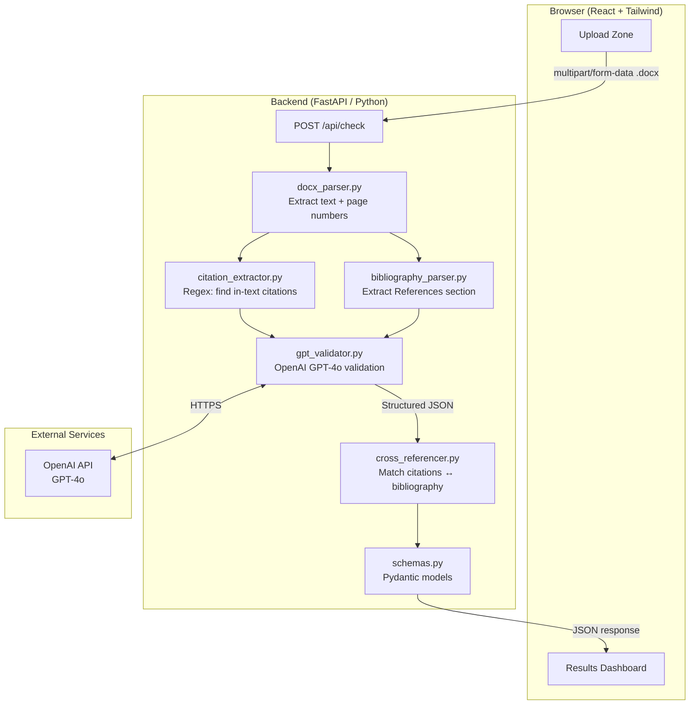
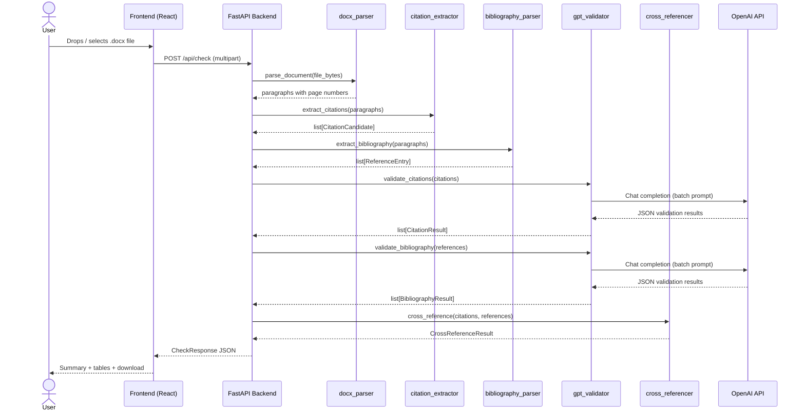
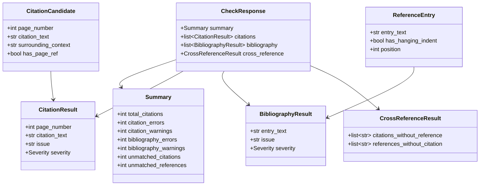
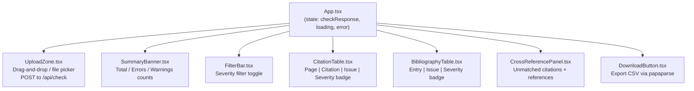

# APA7 Reference Checker — System Architecture

---

## 1. High-Level Architecture



---

## 2. Request / Response Flow



---

## 3. Backend Service Layer

```mermaid
graph LR
    subgraph services["services/"]
        A[docx_parser.py\n─────────────\nparse_document()\ntrack page breaks\nreturn paragraphs+pages]
        B[citation_extractor.py\n─────────────\nextract_citations()\nregex patterns for\nparenthetical + narrative]
        C[bibliography_parser.py\n─────────────\nextract_bibliography()\ndetect References heading\nparse individual entries]
        D[gpt_validator.py\n─────────────\nvalidate_citations()\nvalidate_bibliography()\nbatch GPT calls\nJSON mode output]
        E[cross_referencer.py\n─────────────\ncross_reference()\nauthor-year key matching\nunmatched detection]
    end

    A --> B
    A --> C
    B --> D
    C --> D
    D --> E
```

---

## 4. Data Models



---

## 5. Frontend Component Tree



---

## 6. Deployment Architecture


> **Note:** For production, place an Nginx reverse proxy in front of Uvicorn and serve the
> React build from Nginx directly. The FastAPI backend remains an internal service.

---

## 7. GPT Validation Flow


