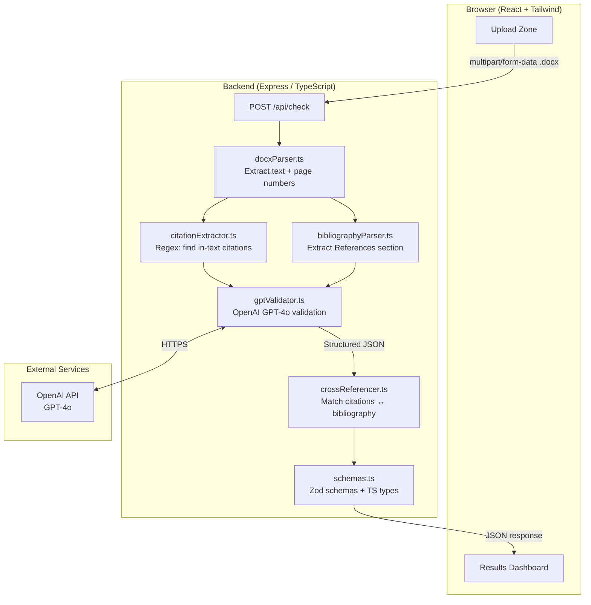
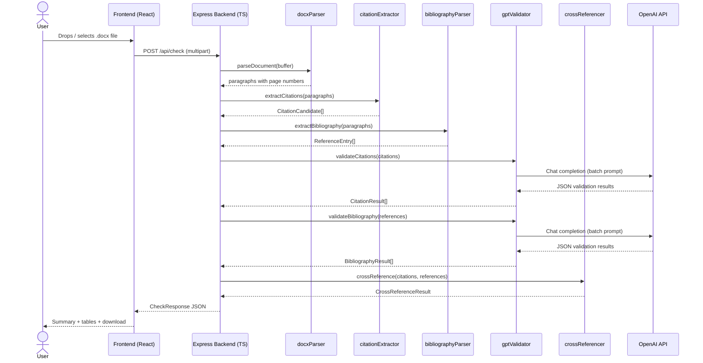
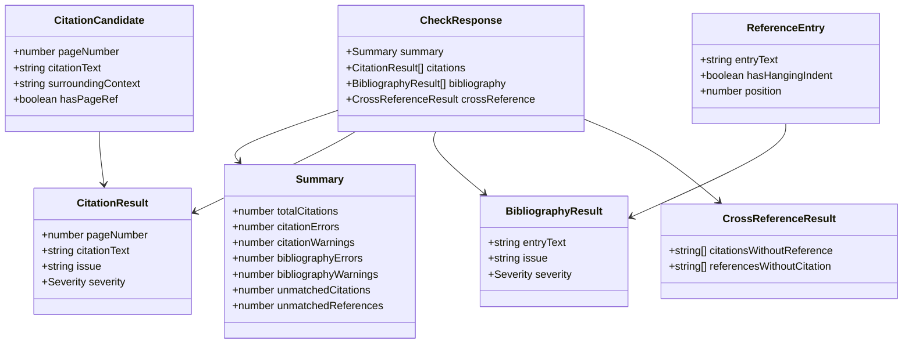
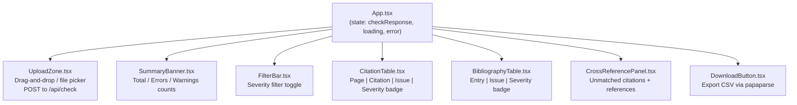
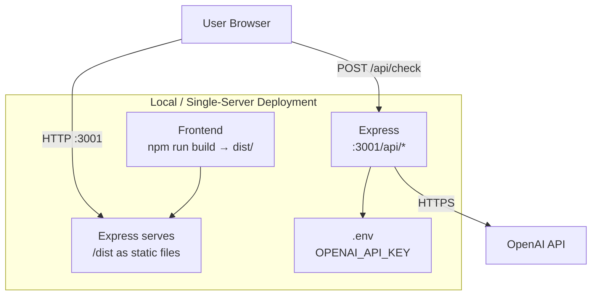
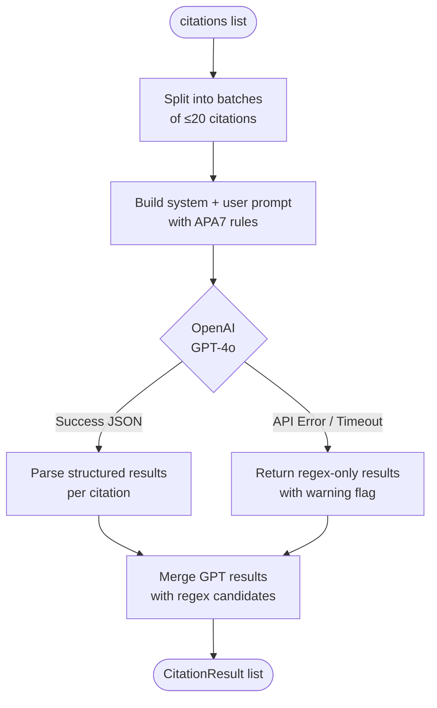

# APA7 Reference Checker — System Architecture

---

## 1. High-Level Architecture



---

## 2. Request / Response Flow



---

## 3. Backend Service Layer

```mermaid
graph LR
    subgraph services["services/"]
        A[docxParser.ts\n─────────────\nparseDocument()\ntrack page breaks\nreturn paragraphs+pages]
        B[citationExtractor.ts\n─────────────\nextractCitations()\nregex patterns for\nparenthetical + narrative]
        C[bibliographyParser.ts\n─────────────\nextractBibliography()\ndetect References heading\nparse individual entries]
        D[gptValidator.ts\n─────────────\nvalidateCitations()\nvalidateBibliography()\nbatch GPT calls\nJSON mode output]
        E[crossReferencer.ts\n─────────────\ncrossReference()\nauthor-year key matching\nunmatched detection]
    end

    A --> B
    A --> C
    B --> D
    C --> D
    D --> E
```

---

## 4. Data Models



---

## 5. Frontend Component Tree



---

## 6. Deployment Architecture



> **Note:** For production, place an Nginx reverse proxy in front of the Node server and
> serve the React build from Nginx directly. The Express backend remains an internal service.

---

## 7. GPT Validation Flow


